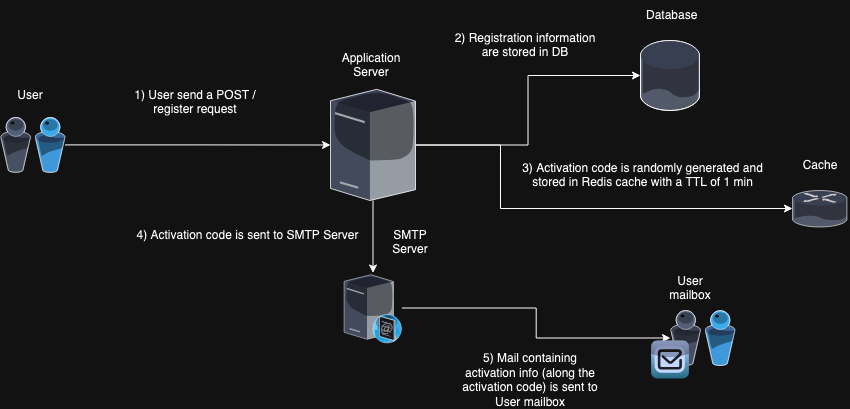
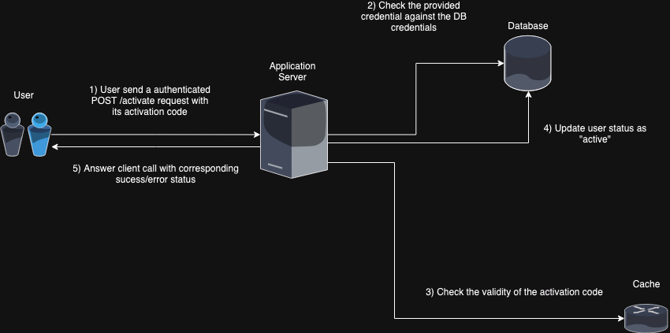

# Dailymotion Technical Interview Test Project

This project demonstrates a possible architecture for handling account registration and activation, featuring a modern tech stack with FastAPI, MySQL, and Redis. It is designed to provide a clean separation of concerns using Domain-Driven Design (DDD) principles, focusing on flexibility, security, and maintainability.

## How to Use

1. **Clone the repository:**
   ```bash
   git clone https://github.com/SilversMind/dailymotion_project.git
   cd dailymotion_project.git
   ```

2. **Run Docker Compose:**
   ```bash
   docker-compose up --build
   ```

   This will spin up the necessary services, including:
   - Application server (FastAPI)
   - MySQL database
   - Redis cache

3. **Run Tests:**
   We use a dedicated test database and caching system. Ensure the entire architecture is up and running before executing the integration tests:
   ```bash
   pytest
   ```

## Project Overview

This project aims to provide a robust framework for user account activation. You can consult the **Swagger documentation** to explore the available API routes for the current version. Swagger is automatically available when you run the application on the `/docs` route.

### Architecture

The current architecture is designed as follows:


#### Components:
- **Application Server:** FastAPI
- **Database:** MySQL
- **Cache:** Redis (Alpine)
- **SMTP Server** MailHog

### Account Registration Flow



Note: The SMTP server does not send real email but it is possible
to consult the mocked email in a WebGUI on **localhost:8025**.

The activation code is also visible in the application server log after successful registration

```dailymotion_project-app-1    | 1995-12-13 12:00:00:000 - Dailymotion WebApp Logger - INFO - Sending activation code 5425 to johndoe@dailymotion.fr```

### Account Rctivation Flow



### Key Features

This architecture adheres to DDD principles, promoting a clear separation between the application domains, with only `auth` domain for now. Business logic is isolated from the infrastructure layer to allow seamless replacement of external technologies like databases, caches, or email services.

Some key features include:
- **Input Validation:** Strong validation using Pydantic schema/models
- **Password Security:** Secure storage and verification using encryption
- **Activation Code Randomization:** Safeguards to ensure security in the activation process
- **Error Handling:** Comprehensible error management throughout the application
- **SQL Protection:** Use of PDO to prevent SQL injection
- **Customizable Token Settings:** Configurable token length and expiration time

**Dependency injection** has been leveraged extensively, ensuring easy substitution of database and cache implementations in different environments.

---

I really enjoyed working on this technical test, exploring technologies and design patterns that were new to me. Thank you for the opportunity!
