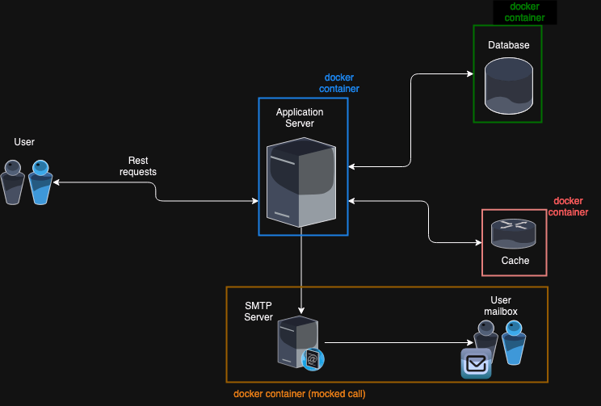

# Account registration & activation

This project demonstrates a possible architecture for handling account registration and activation, featuring a modern tech stack with FastAPI, MySQL, and Redis. It is designed to provide a clean separation of concerns using Domain-Driven Design (DDD) principles, focusing on flexibility, security, and maintainability.

## How to Use

1. **Clone the repository:**
   ```bash
   git clone https://github.com/SilversMind/dailymotion_project.git
   cd dailymotion_project.git
   ```

2. **Run Docker Compose:**
   ```bash
   docker-compose up --build
   ```
   To get only the logs related to the application server, run
   ```bash
   docker-compose up --build --attach app
   ```


3. **Run Tests:**
   We use a dedicated test database and caching system. Ensure the entire architecture is up and running before executing the integration tests.

   If you already have pytest installed, simply run:
   ```bash
   pytest
   ```
    Otherwise, you'll need to access the docker container running the application server
    ```bash
   docker ps # Get the container id of the dailymotion_project_app
   docker exec -it <container_id> bash
   ```
   Once logged in, you can run 
   ```bash
   root@a9f8f862c85f:/app\# pytest
   ```
## Project Overview

This project aims to provide a robust framework for user account activation. You can consult the **Swagger documentation** to explore the available API routes for the current version. Swagger is automatically available when you run the application on the `/docs` route.

### Architecture

The current architecture is designed as follows:



#### Components:
- **Application Server:** FastAPI
- **Database:** MySQL
- **Cache:** Redis (Alpine)
- **SMTP Server** MailHog

### Account Registration Flow


Note: The SMTP server does not send real email but it is possible
to consult the mocked email in a WebGUI on **localhost:8025**.

The activation code is also visible in the application server log after successful registration

```dailymotion_project-app-1    | 1995-12-13 12:00:00:000 - Dailymotion WebApp Logger - INFO - Sending activation code 5425 to johndoe@dailymotion.fr```

### Account Rctivation Flow


### Key Features

This architecture adheres to DDD principles, promoting a clear separation between the application domains, with only `auth` domain for now. Business logic is isolated from the infrastructure layer to allow seamless replacement of external technologies like databases, caches, or email services.

Some key features include:
- **Input Validation:** Strong validation using Pydantic schema/models
- **Password Security:** Secure storage and verification using encryption
- **Activation Code Randomization:** Safeguards to ensure security in the activation process
- **Error Handling:** Comprehensible error management throughout the application
- **SQL Protection:** Use of PDO to prevent SQL injection
- **Customizable Token Settings:** Configurable token length and expiration time

**Dependency injection** has been leveraged extensively, ensuring easy substitution of database and cache implementations in different environments.

### Possible Future Improvements

On top of my head, here are the main improvments I'd work on to improve security
- **Strong Password Policy**: Enforce complexity requirements for user passwords to mitigate the risk of unauthorized access.
- **HTTPS Authentication**: To ensure secure data transmission by encrypting communication between clients and the server.
- **Rate Limiting**: To prevent abuse by limiting the number of requests a user can make in a specified timeframe, protecting against denial-of-service attacks.
- **CSRF Protection**: Safeguard against cross-site request forgery by validating requests to ensure they originate from authenticated users.
- **Docker Service Isolation**: Run each application component in separate containers, enhancing security and scalability by isolating environments.

---

I really enjoyed working on this technical test, exploring technologies and design patterns that were new to me. Thank you for the opportunity!
